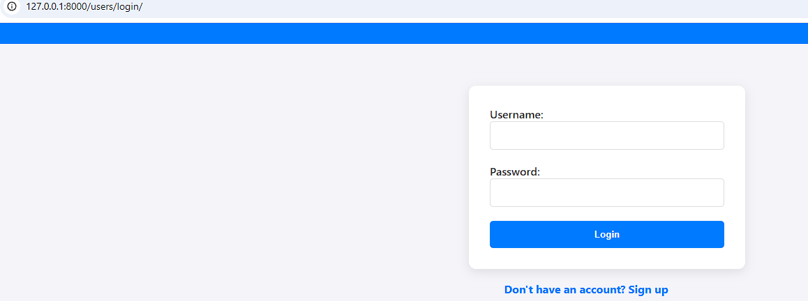
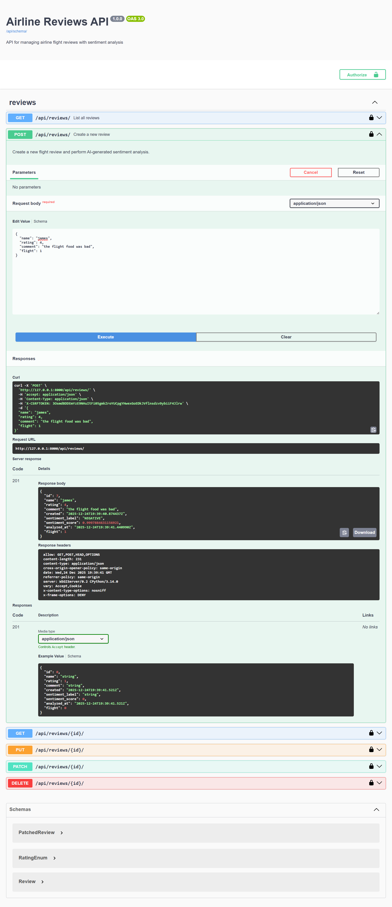

# Django Airline AI

## Overview
This project is a Django-based web application for managing flight bookings and reviews, enhanced with AI sentiment analysis for user reviews.




## Features
- User authentication and management
- Flight management (create, edit, delete flights)
- Review system for flights with sentiment analysis
- Asynchronous task processing using Celery
- Real-time monitoring with Flower

## Requirements
- Python 3.x
- Django
- Celery
- Redis (as a message broker)

## Installation
1. Clone the repository:
   ```bash
   git clone https://github.com/danishdynamic/django-airline-ai.git
   cd django-airline-ai
   ```
2. Create a virtual environment:
   ```bash
   python -m venv env
   source env/bin/activate  # On Windows use `env\Scripts\activate`
   ```
3. Install the required packages:
   ```bash
   pip install -r requirements.txt
   ```
4. Set up the database:
   ```bash
   python manage.py migrate
   ```
5. Run the Redis server (if not using Docker):
   ```bash
   redis-server
   ```
   Or using Docker:
   ```bash
   docker run -d -p 6379:6379 redis:alpine
   ```
6. Start the Celery worker:
   ```bash
   celery -A airline worker --loglevel=info
   ```
7. Start the Django development server:
   ```bash
   python manage.py runserver
   ```

## Usage
- Navigate to `http://127.0.0.1:8000` in your web browser to access the application.
- Use the provided forms to manage flights and reviews.

## API Documentation

This project includes a RESTful API built with Django Rest Framework (DRF).

### API Endpoints
- **/api/reviews/**  
  - `GET`: List all reviews  
  - `POST`: Create a new review  

- **/api/reviews/{id}/**  
  - `GET`: Retrieve a specific review  
  - `PUT`: Update a specific review  
  - `DELETE`: Delete a specific review  

### Documentation

The API documentation is generated using [drf-spectacular](https://drf-spectacular.readthedocs.io/en/latest/). You can access the interactive API documentation at:



- **Swagger UI**: `http://127.0.0.1:8000/api/schema/swagger-ui/`
  
- **ReDoc**: `http://127.0.0.1:8000/api/schema/redoc/`

- **Flower** : using flower for monitoring celery tasks at: `http://127.0.0.1:5555`


Make sure to run the server to access the documentation.

## License
This project is licensed under the MIT License.

## Acknowledgments
- Django Rest framework
- Celery for task management
- Redis for message brokering
- VADER for sentiment analysis

## Future Improvements

- Implement autoscaling and load balancing using AWS or similar cloud services to enhance performance and reliability under varying loads.